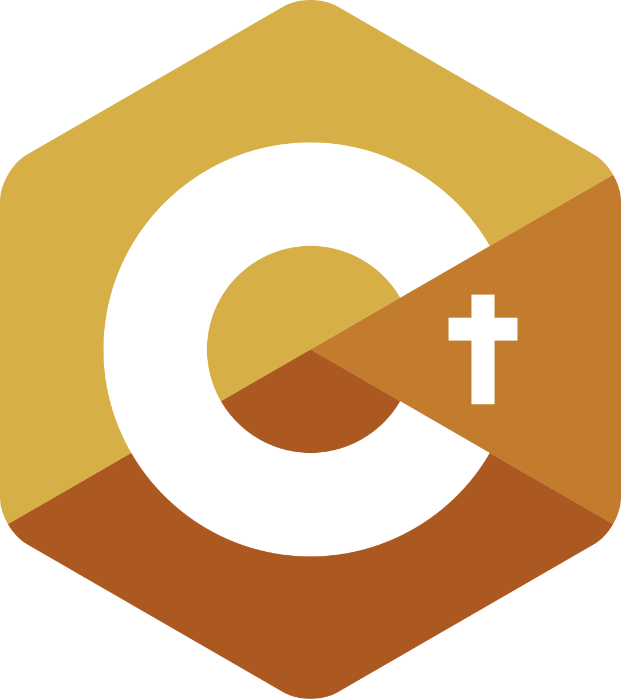

# Introduction

<div align="center">
  
</div>

Welcome to the GLaDOS programming language documentation!

## What is GLaDOS?

GLaDOS (Generic Language and Data Operand Syntax) is a statically-typed, compiled programming language that emphasizes safety and performance. It features:

- **Static type checking** - Catch errors before runtime
- **C-like syntax** - Familiar and easy to learn
- **Bytecode compilation** - Efficient execution
- **Stack-based VM** - Fast and predictable

## Quick Example

```c
int factorial(int n) {
    if (n <= 1) {
        return 1;
    }
    return n * factorial(n - 1);
}

int main() {
    int result = factorial(5);
    return result;
}
```

## Project Goals

This language was designed to prevent common programming errors found in C while maintaining similar syntax and performance characteristics.

## Technologies Used

| Technology | Version | Purpose |
|------------|---------|---------|
| **Haskell** | GHC 9.6.3 | Implementation language |
| **Stack** | LTS 22.6 | Build system |
| **Megaparsec** | Latest | Parser library |
| **Hspec** | ≥ 2.7.0 | Testing framework |
| **Binary** | Latest | Bytecode serialization |

### Why Haskell?

Haskell's strong type system and functional programming paradigms make it ideal for building compilers and type checkers. The language naturally lends itself to writing correct, maintainable compiler infrastructure.
